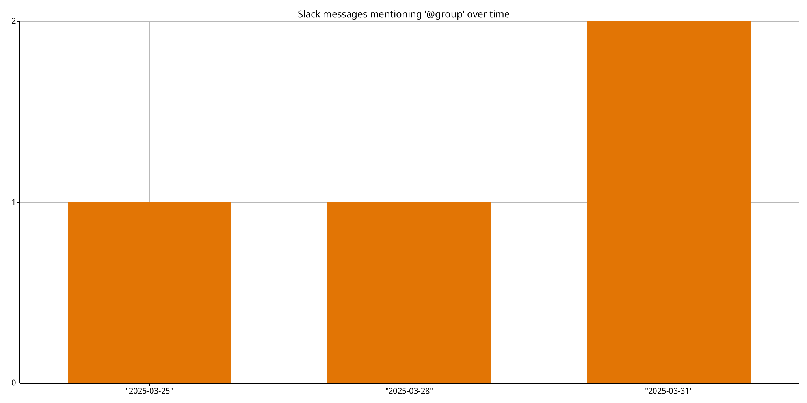

# slackrs

A simple CLI to analyze Slack data exports.

[](https://crates.io/crates/slackrs)
[](https://docs.rs/slackrs)
[](https://github.com/roland-ewald/slackrs/actions/workflows/rust.yml)

## Features

- Plot **number of messages** containing a specific string over time (**histogram**).

- Plot **ratio of messages** containing either one of two specific strings (**line chart**).

- **Export CSV files** with the statistics and allow to aggregate over **different time scales** (daily, monthly, yearly).

- **Simple customization** regarding plot colors.

## Sample usage

### Retrieving the data from Slack

Bulk downloads of (public) messages are available per workspace, but require admin access.

In the 'Slack app', do the following (alternatively, just go to `https://[your-workspace].slack.com/services/export` in the browser):

1. Use the dropdown of the workspace, choose `Tools & Settings` > `Admin Tools`.
2. In the `Admin Tools` go to `Data Exports`.

Then choose an export range and trigger the export.

### Sample task file

The tool processes all messages from the ZIP and then runs a number of tasks, which are defined in JSON:

```json
[
    {
        "metric": {
            "MentionCount": {
                "channel_pattern": "",
                "message_pattern": "@group"
            }
        },
        "resolution": "Daily",
        "output_file_name": "daily-group-mentions-over-time.png"
    }
]    
```

### Running the tool

```shell
./slackrs --input-file="my-slack-export.zip" --task-file=my_tasks.json
```

### Sample output

Plots look like this right now:



Additionally, all plotted data is also provided as a CSV.

### More documentation

To see all command-line arguments, just run:

```shell
./slackrs --help
```